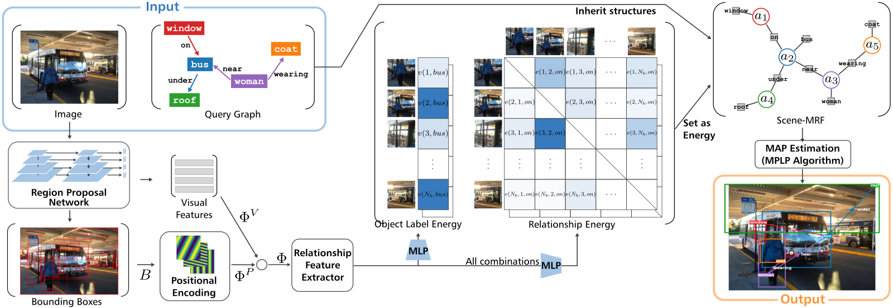
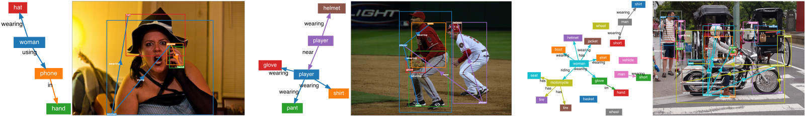

<h1 align="center">
    SceneProp: Combining Neural Network and Markov Random Field for Scene-Graph Grounding
</h1>

<h5 align="center">
    Keita Otani<sup>1</sup>&emsp;
    Tatsuya Harada<sup>1,2</sup>
    <br>
    <sup>1</sup>The University of Tokyo,
    <sup>2</sup>RIKEN AIP
</h5>

<h3 align="center">
    WACV 2026
    <!--<a href="https://openaccess.thecvf.com/content/WACV2026/html/Otani_SceneProp_Combining_Neural_Network_and_Markov_Random_Field_for_Scene-Graph_Grounding_WACV_2026_paper.html">[Paper]</a>-->
</h3>

<div align="center">
    <br>
    <small>Fig.1. Overview of the SceneProp's pipeline.</small>
</div>


## Overview
This repo hosts the official SceneProp implementation. The approach frames scene-graph grounding as MAP inference in a Markov Random Field and runs global, differentiable belief propagation on the full query graph. SceneProp reaches state-of-the-art grounding accuracy and scales well as graphs grow larger and more relationally complex.

<div align="center">
    <br>
    <small>
        Fig.2. Examples of scene-graph grounding results by SceneProp.<br>
        More results can be found in the supplementary material of our paper.
    </small>
</div>

## Preparation
NVIDIA GPU with CUDA is required for training and evaluation.
10GB of GPU memory is needed for training with batch size 1.
Linux is recommended for running the code.

### Repository Setup
Clone the repo and move to its root:
```
git clone https://github.com/KeitaOtani/SceneProp.git
cd SceneProp
```

### Environment Setup
1. Ensure NVIDIA Driver >= 560 and CUDA Toolkit >= 11 are installed.

2. Install `uv` if needed:
```
curl -LsSf https://astral.sh/uv/install.sh | sh
```
More details can be found at https://docs.astral.sh/uv/getting-started/installation/.

3. Create the environment with `uv`:
```
uv sync
```

### Datasets
Organize datasets with the following structure:
```
dataset/
├── VisualGenome_v1.4/
│   ├── imdb_1024.h5
│   ├── VG-SGG.h5
│   └── VG-SGG-dicts.json
├── vl-mpag/
│   ├── localization_VGFO_vg150vr40_train.json
│   ├── localization_VGFO_vg150vr40_test.json
│   ├── localization_VGPO_vg150vr40_similar25_train.json
│   ├── localization_VGPO_vg150vr40_similar25_test.json
│   └── category_names.json
├── MSCOCO/
│   └── 2017/
│       ├── train2017/
│       │   └── *.jpg
│       └── val2017/
│           └── *.jpg
├── coco-stuff/
│   ├── train.json
│   ├── val.json
│   └── category_names.json
└── GQA/
    ├── images/
    │   └── *.jpg
    ├── train_sceneGraphs.json
    └── val_sceneGraphs.json
```

Download sources:
- Visual Genome:
    - Download and conversion scripts are available at https://github.com/danfeiX/scene-graph-TF-release
- VL-MPAG (for VGFO and VGPO):
    - Included in this repository. Original source: https://github.com/anonymous9039/SGL_data
- COCO-Stuff:
    - Download images from https://cocodataset.org/#download
    - The converted scene graph annotations are in this repository. Original conversion script: https://github.com/google/sg2im/blob/master/sg2im/data/coco.py
- GQA:
    - Download from https://cs.stanford.edu/people/dorarad/gqa/download.html

### Pretrained Models
Download the pretrained model from the link below and place it in the repo root:
https://huggingface.co/GLIPModel/GLIP/resolve/main/glip_a_tiny_o365.pth

This checkpoint is an object detector trained on O365 with Dynamic Head, not a phrase-grounding model. See https://github.com/microsoft/GLIP and the GLIP paper for details.


## Training
Use `torchrun` for training. For example, to train on two GPUs within one node:
```
uv run torchrun --nnodes=1 --nproc_per_node=2 train.py
```
Adjust batch size and gradient accumulation in `config.yaml`. Effective batch size is:
```
effective_batch_size = nnodes * nproc_per_node * (batch_size per GPU) * (gradient accumulation steps)
```

## Evaluation
Run evaluation with:
```
uv run evaluate.py --model OUTPUT/VGFO/iter_0050000.pth
```
Replace `OUTPUT/VGFO/iter_0050000.pth` with your model path.
